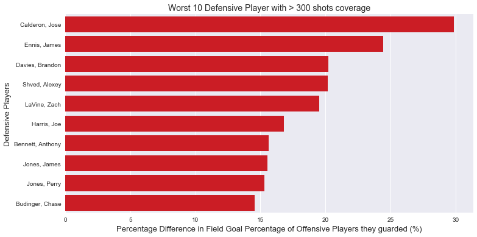

# NBA_Shots_Analysis
Analysis on shots record from NBA season 2014-2015

# Dataset

Data on shots taken during the 2014-2015 season, who took the shot, where on the floor was the shot taken from, who was the nearest defender, how far away was the nearest defender, time on the shot clock, and much more. The column titles are generally self-explanatory.

Useful for evaluating who the best shooter is, who the best defender is, the hot-hand hypothesis, etc.

Scraped from NBA's REST API.

# Results

